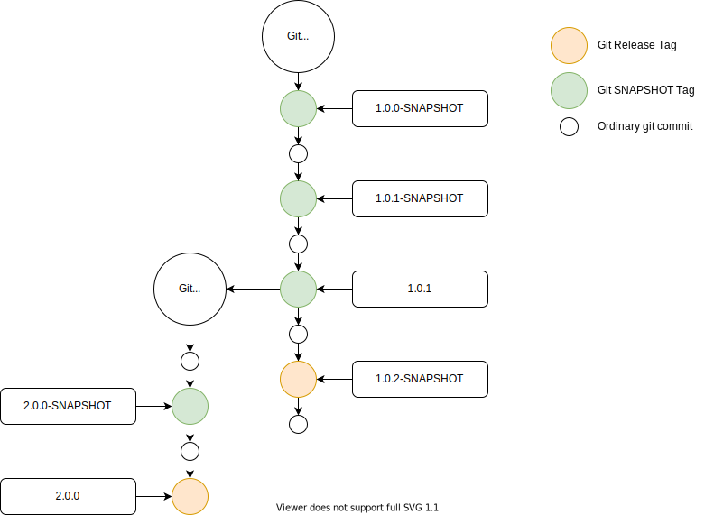
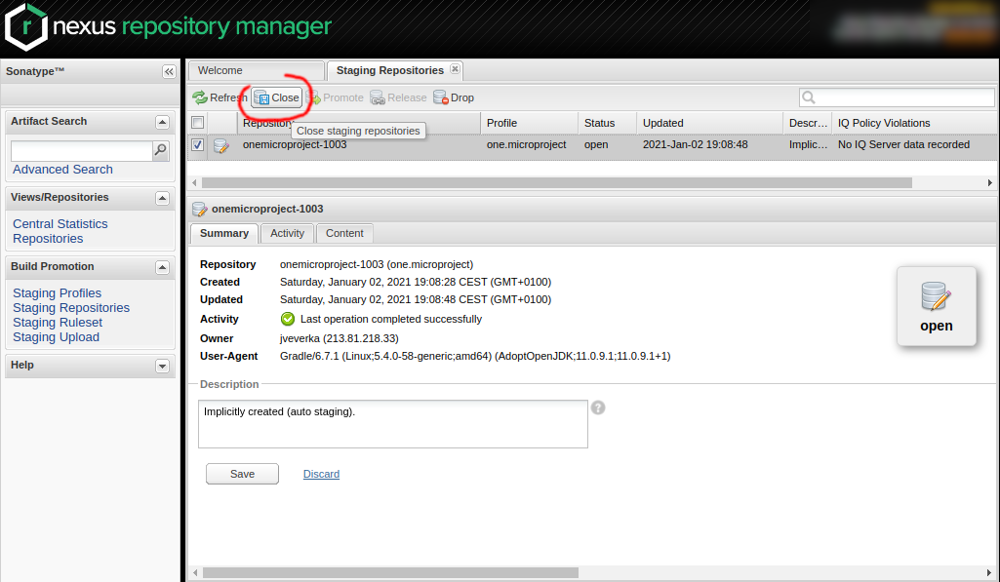

# ORSSH Maven Artefact publishing
This project was created just to test artefact publishing into [maven central](https://repo.maven.apache.org/maven2) 
repository. ``org.microproject`` group ID is used in this example. In order to publish your own code,
you will have to register your own group ID.

## 1. Sonatype account setup
* Sonatype account setup is done only once per group ID.
* Create account at [https://issues.sonatype.org](https://issues.sonatype.org/secure/Dashboard.jspa),
  Register groupId (org.microproject), get __ossrhUsername__ and __ossrhPassword__ - 
  your own OSSRH credentials.
  * [Getting started](https://central.sonatype.org/pages/producers.html)
  * [Choose your coordinates](https://central.sonatype.org/pages/choosing-your-coordinates.html)
* Create new GPG key.
  ```
  gpg --gen-key
  gpg --export-secret-keys -o ~/.gnupg/secring.gpg
  gpg2 --list-keys  
  gpg2 --list-keys --keyid-format short
  ```
* Upload created GPG public key to public key servers, so others can verify.  
  ```
  gpg2 --keyserver http://keyserver.ubuntu.com:11371 --send-keys <YourKeyId>
  gpg2 --keyserver http://keys.gnupg.net:11371 --send-keys <YourKeyId>
  gpg2 --keyserver http://pool.sks-keyservers.net:11371 --send-keys <YourKeyId>
  ```
  YourKeyId = last 8 characters from public key ID
* Create property file ``~/.gradle/gradle.properties`` with content.
  ```
  signing.keyId=<YourKeyId>
  signing.password=<YourKeyPassword>
  signing.secretKeyRingFile=<PathToYourKeyRingFile>
  ossrhUsername=username
  ossrhPassword=********
  ```
  YourKeyPassword = password used for key generation  
  PathToYourKeyRingFile = path to previously exported secring.gpg file

## 2. Project Compile & Test
```
gradle clean build test
```

### Project versioning
It is recommended to use [semantic versioning](https://semver.org/). 
This is example project versioning and branching plan.
Example: ``1.0.0-SNAPSHOT < 1.0.0``.



## 3. Publish
```
gradle publishToMavenLocal
gradle publish
```
Last step __gradle publish__, based on current artefact version publishes to snapshot or stage repository.

### 3.1 SNAPSHOT artefacts
Artefacts published to [oss.sonatype.org SNAPSHOT](https://oss.sonatype.org/content/repositories/snapshots)
repository must have __-SNAPSHOT__ version suffix. No further action required after __gradle publish__ command.
* [Published SNAPSHOT artefact example](https://oss.sonatype.org/content/repositories/snapshots/one/microproject/test/test-artefact/1.0.4-SNAPSHOT)

### 3.2 Stage and Release artefacts
Artefacts published to [oss.sonatype.org stage](https://oss.sonatype.org/service/local/staging/deploy/maven2)
repository must NOT have __-SNAPSHOT__ version suffix. Release is finished manually using
[sonatype nexus UI](https://oss.sonatype.org/#stagingRepositories). Login using your OSSRH credentials.
After __gradle publish__ action, staging repository is in __open__ state. 
* Next step will close staging repository. Close action will verify published artefacts.
  
* After staging repository is closed successfully, there are 2 options: Release or Drop.  
  
* In case Release is selected, staging repository is fully published to maven central. 
  You have to wait until the release propagates into official maven repositories.
* [Published Release artefact example](https://repo.maven.apache.org/maven2/one/microproject/test/test-artefact/1.0.7)
* [Published Release artefact search](https://search.maven.org/search?q=g:one.microproject.test%20AND%20a:test-artefact)

## 4. Consuming SNAPSHOT Artefacts
### Consuming SNAPSHOT Artefact in Maven
```
<project ...>
    ...
    <dependencies>
        <dependency>
            <groupId>one.microproject.test</groupId>
            <artifactId>test-artefact</artifactId>
            <version>1.0.4-SNAPSHOT</version>
        </dependency>
    </dependencies>
    <repositories>
        <repository>
            <id>sonatype-snapshot</id>
            <url>https://oss.sonatype.org/content/repositories/snapshots</url>
        </repository>
    </repositories>
</project>
```

### Consuming SNAPSHOT Artefact in Gradle
```
dependencies {
  implementation 'one.microproject.test:test-artefact:1.0.4-SNAPSHOT' 
}
repositories {
    maven {
        url "https://oss.sonatype.org/content/repositories/snapshots"
    }
}
```
## 5. Consuming Released Artefacts
### Consuming Released Artefact in Maven
```
<project ...>
    ...
    <dependencies>
        <dependency>
            <groupId>one.microproject.test</groupId>
            <artifactId>test-artefact</artifactId>
            <version>1.0.7</version>
        </dependency>
    </dependencies>
</project>
```

### Consuming Released Artefact in Gradle
```
dependencies {
  implementation 'one.microproject.test:test-artefact:1.0.7' 
}
```

## References
* [Publish into the Central repository](https://central.sonatype.org/pages/producers.html)
* [Gradle Signing Plugin](https://docs.gradle.org/current/userguide/signing_plugin.html)
* [Gradle Maven Publish Plugin](https://docs.gradle.org/current/userguide/publishing_maven.html)
* [Working with PGP Signatures](https://central.sonatype.org/pages/working-with-pgp-signatures.html)
* [Sign and publish on Maven Central](https://medium.com/@nmauti/sign-and-publish-on-maven-central-a-project-with-the-new-maven-publish-gradle-plugin-22a72a4bfd4b)
